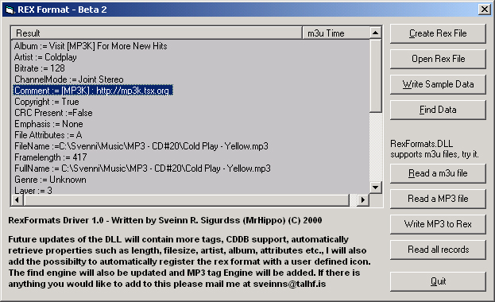



## rexFormats\.DLL Beta \#2 \- The most awesome playlist DLL ever written \(mp3, m3u, wav, rex\)\.

### Description

Most playlist do not contain more than two or three fields. They are missing powerful search engines. If you have more than a 100 songs on your computer, you may have difficulties finding them in your playlist. By using rexFormats.DLL (freeware) you can build powerful music applications with the most awesome playlists ever created, more than 100 tags and a powerful search engine comes with it. A sample application comes along with it. Try it now.

Just Updated to beta 2 with more powerful search engine, mp3 engine etc.
 
### More Info
 

             |
---                |---
**Submitted On**   |2000-11-27 13:48:00
**By**             |[N/A](https://github.com/Planet-Source-Code/PSCIndex/blob/master/ByAuthor/empty.md)
**Level**          |Beginner
**User Rating**    |3.5 (14 globes from 4 users)
**Compatibility**  |VB 6\.0
**Category**       |[Sound/MP3](https://github.com/Planet-Source-Code/PSCIndex/blob/master/ByCategory/sound-mp3__1-45.md)
**World**          |[Visual Basic](https://github.com/Planet-Source-Code/PSCIndex/blob/master/ByWorld/visual-basic.md)
**Archive File**   |[CODE\_UPLOAD1211511272000\.zip](https://github.com/Planet-Source-Code/rexformats-dll-beta-2-the-most-awesome-playlist-dll-ever-written-mp3-m3u-wav-rex__1-13128/archive/master.zip)

